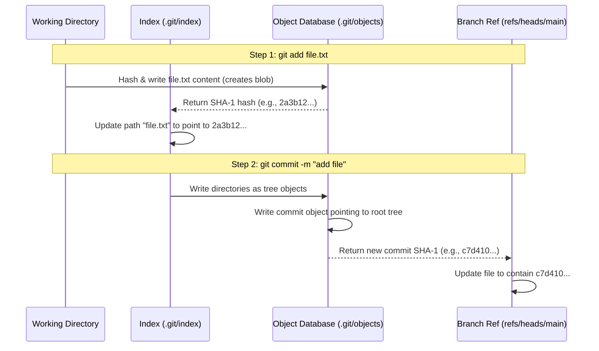

# Git & GitHub: Comprehensive Interview Preparation Guide

This guide is designed for software engineers preparing for technical interviews. It covers everything from basic terminology to low-level Git internals, advanced history rewriting, collaboration workflows, and complex scenario-based problem-solving.

---

## Table of Contents
1. [Version Control Systems & Git Philosophy](#1-version-control-systems--git-philosophy)
2. [Git Deep Dive: Internals & The Data Model](#2-git-deep-dive-internals--the-data-model)
3. [File Lifecycle & The Three States](#3-file-lifecycle--the-three-states)
4. [Branching, Merging, & Rebasing Internals](#4-branching-merging--rebasing-internals)
5. [Undoing Changes & History Rewriting](#5-undoing-changes--history-rewriting)
6. [Remote Operations & Collaborative Workflows](#6-remote-operations--collaborative-workflows)
7. [Advanced Git Concepts & Commands](#7-advanced-git-concepts--commands)
8. [GitHub & Platform-Level Workflows](#8-github--platform-level-workflows)
9. [Top 15 Scenario-Based Interview Q&As](#9-top-15-scenario-based-interview-qas)

---

## 1. Version Control Systems & Git Philosophy

### Centralized vs. Distributed Version Control Systems

| Feature | Centralized VCS (CVCS) (e.g., SVN, Perforce) | Distributed VCS (DVCS) (e.g., Git, Mercurial) |
| :--- | :--- | :--- |
| **Storage Architecture** | A single central server hosts the repository and its full history. Clients check out only a single snapshot of the files. | Every client contains a full, independent copy of the entire repository, including its complete history. |
| **Network Dependence** | High. Almost all operations (commit, diff, log, branch) require a connection to the central server. | Low. Most operations are performed locally. Network connection is only required to synchronize (push/pull). |
| **Single Point of Failure** | High. If the server goes down, collaboration halts. If the disk corrupts without backups, the entire history is lost. | Low. If the server goes down, any developer's local copy can be used to fully restore the repository. |
| **Performance** | Operations are slow as they must round-trip to the server. | Local operations are nearly instantaneous. |
| **Branching & Merging** | Heavyweight and slow. Often involves copying directories on the server. | Lightweight, fast, and core to the development workflow. |

---

### Git's Key Design Philosophy: Snapshots, Not Deltas

Most traditional VCS systems (like SVN) store information as a list of file-based changes over time. They keep a base file and store a series of cumulative differences (deltas) for each version.

```
SVN (Delta-Based):
[File A v1] ---> [Δ1] ---> [Δ2] ---> [Δ3]
[File B v1] ---> [Δ1] ------------------> [Δ2]
```

Git, by contrast, thinks of its data as a stream of **snapshots** of a miniature filesystem. Every time you commit (save the state of your project), Git takes a picture of what all your files look like at that moment and stores a reference to that snapshot.

```
Git (Snapshot-Based):
Commit 1: [File A v1] [File B v1]
Commit 2: [File A v2] [File B v1 (Pointer)]
Commit 3: [File A v2 (Pointer)] [File B v2]
```

* **Storage Efficiency**: To avoid wasting disk space, if a file has not changed in a commit, Git does not store the file again. Instead, it simply stores a link (pointer) to the previous identical file it has already stored. This makes branch creation, switching, and merging extremely cheap.

---

## 2. Git Deep Dive: Internals & The Data Model

Git is fundamentally a **content-addressable filesystem** with a VCS user interface wrapped around it. All objects in Git are stored in the `.git/objects/` directory.

### The Cryptographic Hash Function (SHA-1 / SHA-256)
Git addresses all content by a unique cryptographic hash. By default, Git uses **SHA-1** (a 40-character hexadecimal string, 160-bit). Newer versions of Git support **SHA-256** (64-character hexadecimal, 256-bit).
* The hash is computed from the object type, the size of the content, a null byte terminator, and the content itself:
  $$\text{SHA-1} = \text{hash}(\text{"type space size null-byte content"})$$
* Because the hash is based entirely on the contents, identical file content will *always* generate the exact same hash across any machine, allowing for automatic deduplication.

---

### The Four Core Git Object Types
Inside `.git/objects/`, objects are stored in subdirectories named after the first two characters of their SHA-1 hash, with the remaining 38 characters forming the filename. The objects are compressed using `zlib`.

```
.git/objects/
├── 2a/
│   └── 3b12c8d567... (Blob)
├── 8f/
│   └── 9a45e7f123... (Tree)
└── c7/
    └── d410b001a2... (Commit)
```

There are four primary object types:

#### 1. Blobs (Binary Large Objects)
* **Purpose**: Store raw file data.
* **Characteristics**: A blob contains only the text or binary contents of a file. It does **not** store the filename, the folder path, creation dates, or file permissions (read/write/execute).
* **Format**: `blob <size>\0<content>`

#### 2. Trees
* **Purpose**: Represent directories and folder structures.
* **Characteristics**: A tree maps names and file modes to SHA-1 hashes of blobs or other sub-trees. This is how Git reconstructs directory paths and keeps track of file permissions.
* **Format**: A list of entries, where each entry contains:
  * **File Mode**: E.g., `100644` (normal file), `100755` (executable file), `040000` (directory/tree), `120000` (symbolic link), or `160000` (submodule link).
  * **Object Type**: `blob` or `tree`.
  * **SHA-1 Hash**: Pointer to the target object.
  * **Name**: The actual filename or directory name.

#### 3. Commits
* **Purpose**: Store metadata about a snapshot.
* **Characteristics**: A commit object points to a single root `tree` object (representing the top-level directory of the project) and includes details of how and when the snapshot was made.
* **Format**:
  * `tree <hash>`: Reference to the root tree object representing the snapshot.
  * `parent <hash>`: Zero, one, or more parent commit hashes (merge commits have multiple parents; the root commit has none).
  * `author <name> <email> <timestamp> <timezone>`: Who wrote the code.
  * `committer <name> <email> <timestamp> <timezone>`: Who applied/committed the code (important for rebases/cherry-picks).
  * `<commit message>`: User-provided description.

#### 4. Annotated Tags
* **Purpose**: Create a permanent, named pointer to a specific commit, complete with metadata.
* **Characteristics**: Points to a commit and contains the tagger's name, date, message, and optional GPG signature.
* *Note: A lightweight tag is NOT an object; it is merely a reference (see below).*

---

### How References (Refs) Work
References are simple text files containing a 40-character SHA-1 commit hash. They act as human-readable aliases for commit hashes and are stored in the `.git/refs/` directory.

```
.git/refs/
├── heads/        # Local branches (e.g., main, feature-x)
├── tags/         # Tags (both lightweight and pointers to annotated tags)
└── remotes/      # Remote tracking branches (e.g., origin/main)
```

* **Local Branches (`refs/heads/`)**: A branch in Git is literally a mutable pointer to a commit. When you commit while on a branch, Git updates the file `refs/heads/<branch-name>` with the new commit hash.
* **Tags (`refs/tags/`)**: An immutable pointer. It never moves unless explicitly overwritten.
* **HEAD File (`.git/HEAD`)**: A special reference that points to the current checkout context.
  * In normal states, it is a symbolic reference (symref) pointing to the active branch pointer: `ref: refs/heads/main`
  * In a **Detached HEAD** state, it contains a raw commit hash directly (e.g., `8f9a45e7f123...`).

---

## 3. File Lifecycle & The Three States

A file in a Git workspace transitions between three main logical areas and several states.

```
  Working Directory             Staging Area (Index)           Local Repository
+--------------------+        +---------------------+        +--------------------+
|  Modify a file     | =====> |  git add <file>     | =====> |  git commit        |
|  (Untracked/Dirty) |        |  (Staged Snapshot)  |        |  (Immutable Hist.) |
|                    | <===== |                     | <===== |                    |
|  git checkout/     |        |  git reset          |        |  git reset --soft  |
|  restore <file>    |        |                     |        |                    |
+--------------------+        +---------------------+        +--------------------+
```

### The Three Logical Areas
1. **Working Directory (Working Tree)**: The physical sandbox on your local disk containing the files you are currently modifying.
2. **Staging Area (Index)**: A single binary file located at `.git/index`. It acts as a preparation area where Git stores a formatted tree of what will go into the next commit. It lists all tracked paths, their timestamps, file permissions, and target blob hashes.
3. **Local Repository (Git Directory)**: The `.git` folder, containing the compressed object database and all reference pointers representing your committed history.

---

### Detailed File Lifecycle States
* **Untracked**: A file exists in the Working Directory but is not listed in the Index. Git has no record of it.
* **Tracked**: A file that was either in the previous commit or is staged in the Index.
  * **Unmodified**: Staged index and local repository match the working directory.
  * **Modified**: The file has been changed in the working directory but not yet staged in the index.
  * **Staged**: The modified file's changes have been hashed and written to `.git/objects/`, and the index has been updated to point to the new blob hash.

---

### Anatomy of `git add` and `git commit` Under the Hood

When you execute commands, the internal files and databases change as follows:



1. **`git add file.txt`**:
   * Git reads `file.txt` from the Working Directory.
   * Git calculates the SHA-1 of the file content.
   * Git compresses the file and writes a new **blob** object to `.git/objects/` with that hash (if the blob doesn't already exist).
   * Git updates the binary `.git/index` file to link path `"file.txt"` with the new blob's hash.
2. **`git commit -m "add file"`**:
   * Git reads the `.git/index` file to find the paths and associated blob hashes.
   * Git writes necessary **tree** objects (representing directories) to `.git/objects/` to recreate the project folder structure.
   * Git writes a new **commit** object containing the root tree hash, current author/committer information, parent commit hash (retrieved from `.git/HEAD`), and the message.
   * Git updates the reference file of the current branch (e.g., `.git/refs/heads/main`) with the new commit's hash.

---

### Command Guide: Tracking and Comparing

* **`git status`**: Inspects differences between the Working Directory, the Index, and the HEAD commit to determine the state of files.
* **`git diff`**: Compares the **Working Directory** with the **Index**. Displays unstaged changes.
* **`git diff --cached` (or `--staged`)**: Compares the **Staging Area (Index)** with the **HEAD** commit. Displays what you are about to commit.
* **`git diff HEAD`**: Compares the **Working Directory** directly with the **HEAD** commit. Displays all changes (both staged and unstaged) since the last commit.
* **`git diff <commit1> <commit2>`**: Compares snapshots between two arbitrary commits.

---

## 4. Branching, Merging, & Rebasing Internals

### Branching Internals
Because a branch is just a 41-byte text file containing a 40-character commit hash and a newline character, branches are incredibly cheap.
* **`git branch feature-x`**: Writes a file `.git/refs/heads/feature-x` containing the hash of the current commit.
* **`git switch feature-x` (or `git checkout feature-x`)**: Changes `.git/HEAD` to point to `refs/heads/feature-x`, updates the staging area (index) to match that commit's tree, and replaces files in the working directory.

---

### Merging Mechanisms

When merging one branch into another, Git uses two main strategies:

#### 1. Fast-Forward Merge (Linear)
* **Condition**: The target branch has no commits that are not already present in the source branch (i.e., the source branch is a direct ancestor of the target branch).
* **Behavior**: Git simply moves the branch pointer forward to the commit pointed to by the source branch. No new commit is created.
* **Command override**: Use `git merge --no-ff <branch>` to force Git to create a merge commit even if a fast-forward is possible. This preserves the historical record of the branch's existence.

```
Before Fast-Forward:
A --- B (main)
       \
        C --- D (feature)

After git merge feature (Fast-Forward):
A --- B --- C --- D (main, feature)

After git merge --no-ff feature (Forced Merge Commit):
A --- B ----------- M (main)
       \           /
        C ------- D (feature)
```

#### 2. Three-Way Merge (Diverged History)
* **Condition**: The histories of the two branches have diverged; both have unique commits.
* **Behavior**:
  1. Git locates the **Merge Base**: The closest common ancestor commit of the two branches (using the lowest common ancestor algorithm on the DAG).
  2. Git compares three snapshots: the Merge Base, the tip of the current branch (HEAD), and the tip of the incoming branch.
  3. Git generates a new **Merge Commit** containing the merged changes. This commit has two parent pointers.

```
Diverged History:
      C --- D (main)
     /
A --- B (Merge Base)
     \
      E --- F (feature)

After 3-Way Merge (Creates Merge Commit M):
      C --- D ------ M (main)
     /              /
A --- B            /
     \            /
      E --- F ---/ (feature)
```

---

### Merge Conflicts
If Git finds that the same line in the same file has changed differently in both branches (or a file was deleted in one but modified in another), it cannot automatically resolve the merge.
* Git marks the conflicted files in the staging area (using conflict index stages 1, 2, and 3 internally in the index).
* Git inserts **conflict markers** into the working directory files:
  ```txt
  <<<<<<< HEAD
  Code on the current active branch (your changes)
  =======
  Code on the incoming branch (their changes)
  >>>>>>> branch-name
  ```
* **Resolution**: You must edit the file, remove the markers, choose which code to keep, run `git add <file>` to clear the conflict state in the index, and run `git commit` to write the merge commit.

---

### Rebasing Internals

Rebasing is the process of moving or combining a sequence of commits to a new base commit.

* **Under the Hood**:
  1. Git identifies the common ancestor (merge base).
  2. Git collects all commits made on the current branch after that ancestor.
  3. Git temporarily saves these commits as diffs (patches) in a directory called `.git/rebase-apply/`.
  4. Git resets the current branch pointer to point to the target branch (the new base).
  5. Git applies each saved patch commit in order onto the new base, creating brand-new commit objects with different hashes (due to different parents, dates, and author metadata).

```
Before Rebase:
      C --- D (main)
     /
A --- B
     \
      E --- F (feature)

After git rebase main:
      C --- D (main) --- E' --- F' (feature)
     /
A --- B
```

#### The Golden Rule of Rebasing
> [!IMPORTANT]
> **Never rebase commits that have been pushed to a public/shared repository.**
> Since rebasing rewrites commit hashes, if you rebase pushed commits, you force other developers working on the same branch to deal with diverged histories, requiring painful `git pull --rebase` interventions.

---

### Merging vs. Rebasing

| Feature | Merging (`git merge`) | Rebasing (`git rebase`) |
| :--- | :--- | :--- |
| **History Integrity** | Preserves historical timeline and merge events. True representation of what happened. | Rewrites history to represent a clean, linear progression of commits. |
| **Commit Graph** | Can become messy and non-linear ("train tracks") on large projects. | Clean, linear, and easy to read. |
| **Conflict Resolution** | Done once during the merge commit. | Conflicts must be resolved commit-by-commit as patches are applied. |
| **Usage** | Safe for public, shared branches. | Recommended for cleaning up private branches before merging. |

---

### Advanced Branch Commands
* **Interactive Rebase (`git rebase -i <commit-ish>`)**: Rewrites local commit history. It opens an editor allowing you to choose actions for each commit:
  * `pick`: Keep the commit as-is.
  * `reword`: Keep the commit, but change the commit message.
  * `edit`: Pause during rebase to amend files/commit content.
  * `squash`: Meld the commit into the previous one, merging the commit messages.
  * `fixup`: Meld the commit into the previous one, discarding this commit's message.
  * `drop`: Remove the commit entirely.
* **Cherry-Picking (`git cherry-pick <commit-hash>`)**: Extracts the diff introduced by a single commit from another branch and applies it as a new commit on the current branch.

---

## 5. Undoing Changes & History Rewriting

One of the most common set of interview questions involves recovering from mistakes.

### The Reset Commands: Soft, Mixed, and Hard
`git reset` alters the current `HEAD` pointer and can modify the Index and Working Directory depending on the flags used.

| Flag | Moves `HEAD` & Branch Ref? | Updates Staging Area (Index)? | Updates Working Directory? | Safety |
| :--- | :---: | :---: | :---: | :--- |
| **`--soft`** | **Yes** | No | No | Safe. Staged files are preserved. |
| **`--mixed`** (Default) | **Yes** | **Yes** | No | Safe. Changes remain unstaged in Working Directory. |
| **`--hard`** | **Yes** | **Yes** | **Yes** | **Dangerous**. Uncommitted changes are permanently lost. |

```
                       HEAD  -----> Commit A <----- Commit B (Old HEAD)
                              --soft (Leaves Index & Working Dir at Commit B)
                       Index -----> Commit A <----- Commit B (Old Index)
                              --mixed (Updates Index to match Commit A)
                       Work Dir --> Commit A <----- Commit B (Old Work Dir)
                              --hard (Destroys changes, resets Work Dir to Commit A)
```

---

### `git revert` vs. `git reset`
* **`git reset`**: Rewrites history by moving branch pointers backwards. Best for private branches. **Do not use on public branches.**
* **`git revert <commit>`**: Creates a *new* commit containing the exact opposite changes of the targeted commit. Safe for public branches because it does not alter existing history.

---

### Modern Git Commands: `restore` and `switch`
In Git 2.23, the overloaded `git checkout` command was split into two cleaner commands:
* **`git switch <branch>`**: Switches branches.
* **`git restore <file>`**: Discards modifications in the working directory to match the index.
  * `git restore --staged <file>`: Unstages a file (removes it from the staging area back to the working directory).

---

### `git reflog` (The Ultimate Safety Net)
* **What is it**: Git Reflog (Reference Log) is a local log file that records every single time the `HEAD` pointer moves (e.g., switches branches, makes commits, performs resets, rebases, merges).
* **Storage Location**: Local only (never pushed to remotes) in `.git/logs/HEAD`.
* **Lifetime**: Reflog entries have an expiration date (default is 90 days for reachable commits, 30 days for unreachable ones).
* **How to recover a deleted commit/branch**:
  1. Run `git reflog` to view HEAD movement history.
  2. Locate the commit hash just before the mistake (e.g., `HEAD@{3}`).
  3. Run `git reset --hard <commit-hash>` or `git switch -c <new-branch-name> <commit-hash>` to restore it.

---

## 6. Remote Operations & Collaborative Workflows

### Remotes and Tracking Configuration
* **Remote**: A repository hosted on a network or server (like GitHub). `origin` is the default name Git gives to the remote repository you cloned from.
* **Remote Tracking Branches** (e.g., `origin/main`): Read-only pointers. They reflect the state of the branches on the remote repository at the time of your last connection (`fetch`/`pull`). You cannot move them locally.

---

### `git fetch` vs. `git pull`
* **`git fetch`**: Downloads all objects, refs, and histories from the remote repository to your local computer. It updates remote tracking branch pointers (e.g., `origin/main`) but **does not touch your active working directory or local branches**.
* **`git pull`**: Performs a `git fetch` and then immediately merges the remote tracking branch into your current local branch.
  $$\text{git pull} = \text{git fetch} + \text{git merge}$$
  * *Tip*: `git pull --rebase` is often preferred to keep history linear by rebasing your local commits on top of the fetched remote changes rather than merging.

---

### Common Branching Workflows

#### 1. Git Flow (Feature/Release Branches)
A strict branching model designed around releases.
* **Branches**:
  * `main`: Production-ready code only.
  * `develop`: Integration branch for features.
  * `feature/*`: Branched from `develop`, merged back to `develop`.
  * `release/*`: Branched from `develop` for release prep, merged to `main` and `develop`.
  * `hotfix/*`: Branched from `main` to patch production bugs, merged to `main` and `develop`.
* **Pros/Cons**: Excellent for structured, scheduled release cycles. Overly complex and slow for continuous deployment (CD).

#### 2. GitHub Flow (Feature Branch / PR Workflow)
A lightweight branch-based workflow.
* **Workflow**:
  1. `main` is always deployable.
  2. Create a descriptive branch from `main` (e.g., `feature/login`).
  3. Commit locally, push to remote, open a Pull Request (PR).
  4. Discuss, review, run CI tests.
  5. Merge PR into `main` and deploy immediately.
* **Pros/Cons**: Perfect for agile teams, web applications, and continuous integration/continuous deployment (CI/CD).

#### 3. Trunk-Based Development
Developers merge frequent, small commits into a single central branch (the "trunk", usually `main`).
* **Workflow**:
  * Avoid long-lived feature branches. Branches last at most a day or two.
  * Code is merged directly to the trunk frequently.
  * Relies heavily on **Feature Flags** (toggles) to ship half-finished features to production without exposing them to users.
* **Pros/Cons**: Eliminates "merge hell," enhances integration speed, requires highly automated testing.

---

## 7. Advanced Git Concepts & Commands

### Git Stash Internals
* **What is it**: `git stash` saves your dirty working directory and staging area state, returning you to a clean HEAD state.
* **Internal Representation**: A stash is **not** a simple backup file. It is a set of commit objects stored in `.git/refs/stash`.
  * When you run `git stash`, Git creates two (or three, if stashing untracked files with `-u`) separate commit objects:
    1. A commit representing the Staging Area (index) at stashing time.
    2. A commit representing the Working Directory state, having both the Staging Area stash commit and the base HEAD commit as its parents.
    3. (If `-u` is used) A commit representing untracked files.
* **Commands**:
  * `git stash push -m "message"`: Stash changes with a descriptive message.
  * `git stash list`: View all stashed changes.
  * `git stash apply`: Apply the latest stash without deleting it from the stash list.
  * `git stash pop`: Apply the latest stash and delete it from the stash list.

---

### Git Submodules
* **Concept**: Allows you to keep another Git repository as a subdirectory of your main repository.
* **Mechanism**: The parent repository does not track the files inside the submodule. Instead, it tracks the submodule's remote URL and a specific commit hash.
* **Files**:
  * `.gitmodules`: Stores the submodule configuration (path, URL, branch).
  * The submodule directory is registered in the parent index as a special file mode `160000` (gitlink), containing the submodule's active commit hash.
* **Key Commands**:
  * `git submodule init` / `git submodule update` after cloning a parent repo.
  * `git clone --recurse-submodules <url>` to clone the parent and pull submodules in one command.

---

### Git Hooks
* **Concept**: Scripts located in `.git/hooks/` that run automatically before or after key Git actions (commits, pushes, merges).
* **Types**:
  * **Client-Side Hooks**:
    * `pre-commit`: Runs before you type a commit message. Used to check code style (linting), format, or run unit tests. Can be bypassed with `git commit --no-verify`.
    * `prepare-commit-msg` / `commit-msg`: Used to validate commit message format (e.g., checking Jira ticket numbers).
    * `pre-push`: Runs before pushing code to a remote.
  * **Server-Side Hooks**:
    * `pre-receive`: Runs on the remote server when accepting pushes. Used to block commits containing secrets, check permissions, or enforce repository policies.
    * `post-receive`: Runs after push is completed. Used to trigger CI/CD builds or send notifications.

---

### Garbage Collection & Packfiles (`git gc` / `git prune`)
* **Loose Objects**: When you create commits or amend files, Git writes them as individual compressed files. Over time, these "loose objects" degrade performance.
* **Packfiles**: `git gc` (Garbage Collection) packages these loose objects into a single compressed binary packfile (`.pack`) and creates an index file (`.idx`) for rapid access. It uses delta compression to store diffs between similar files.
* **Pruning**: Objects that are no longer reachable by any branch, tag, or reflog entry (dangling blobs/commits) are deleted from the disk after a default grace period (usually 2 weeks).

---

### Detached HEAD State
* **Cause**: Checking out a specific commit hash, tag, or remote tracking branch rather than a local branch (e.g., `git checkout 8f9a45e`).
* **Consequence**: `HEAD` points directly to the commit object, not a branch pointer. You can inspect code and make commits. However, these commits are not bound to any branch.
* **Recovery / Preservation**: If you make commits and want to save them, run:
  ```bash
  git switch -c new-branch-name
  ```
  This creates a new local branch pointing to your current detached commit.

---

## 8. GitHub & Platform-Level Workflows

GitHub is a collaborative platform built on top of Git, offering unique concepts.

### Forks vs. Branches
* **Branch**: A lightweight pointer to a commit within a single repository. Used by developers with direct write access to the repository.
* **Fork**: A server-side copy of a repository hosted on GitHub under a different user or organization account. Used to make modifications when you do not have write permissions to the source repository. Contribution back to the source is done via cross-repository Pull Requests.

---

### Pull Request (PR) Merge Strategies
When merging a PR, GitHub offers three strategies:

```
Source commits: A --- B --- C (on feature-branch)

1. Create a Merge Commit:
   main: X ----------------- M
          \                /
           A --- B --- C -/  (Keeps full micro-history)

2. Squash and Merge:
   main: X --- ABC (All source commits combined into one commit)

3. Rebase and Merge:
   main: X --- A' --- B' --- C' (Commits replayed on main linearly)
```

1. **Create a Merge Commit**: Merges the branch into `main` using `--no-ff`. Preserves every commit from the feature branch and creates a merge commit.
2. **Squash and Merge**: Combines all commits from the feature branch into a single commit, then appends it to `main`. Cleans up intermediate commits (e.g., "fix typo," "wip").
3. **Rebase and Merge**: Replays all individual commits from the branch onto `main` linearly. Does not create a merge commit.

---

### Authentication Protocol Comparison

| Protocol | Mechanism | Setup | Usage / Security |
| :--- | :--- | :--- | :--- |
| **HTTPS** | Authenticates via Username and Personal Access Token (PAT). | Simple URL cloning. Requires configuring a credential manager to store the PAT. | Easy for beginners. Secure if token lifetimes are limited. |
| **SSH** | Uses asymmetric cryptography (Public/Private key pair). | Requires generating an SSH key, adding the public key to GitHub, and loading the private key locally. | Highly secure. No password prompts once set up. |

---

## 9. Top 15 Scenario-Based Interview Q&As

These real-world scenarios are highly popular in FAANG and top-tier tech interviews.

### Q1: I committed a large binary file or a database credential (password) to my local repository. I haven't pushed it yet. How do I completely remove it so it's not in the Git history?
**Answer**:
A simple `git rm` only removes the file from the latest commit; the file will still exist in the historical commit objects. To completely erase it:
1. If it was only added in the **most recent commit**, undo it using:
   ```bash
   git reset --soft HEAD~1
   git restore --staged path/to/sensitive_file
   rm path/to/sensitive_file
   git commit -m "Correct commit message"
   ```
2. If it was committed **several commits ago** (but not pushed):
   Use the modern `git-filter-repo` tool (which replaces the deprecated, slow `git filter-branch`):
   ```bash
   git filter-repo --path path/to/sensitive_file --invert-paths
   ```
   *Note: This rewrites the hashes of all commits from the point the file was introduced.*

---

### Q2: What is the difference between `git reset --hard HEAD~1` and `git revert HEAD`? When would you use which?
**Answer**:
* **`git reset --hard HEAD~1`**: Moves the branch pointer back by one commit, and completely resets both the index and working directory, erasing the changes of the undone commit.
  * **Use case**: You made a bad commit on a local, unpushed feature branch and want to delete it forever.
  * **Risk**: High. Rewrites history. Never use on public branches.
* **`git revert HEAD`**: Creates a brand-new commit that introduces the opposite changes of the last commit.
  * **Use case**: A bad commit was pushed to `main` and is already shared with the team.
  * **Risk**: Low. Safe. Does not rewrite existing history.

---

### Q3: You realize you accidentally committed changes directly to `main` instead of a feature branch. You have NOT pushed your commits to remote. How do you move these commits to a new branch without losing your changes?
**Answer**:
Since branches are just pointers, you can create a new branch at your current commit, and then reset your local `main` branch back to the remote state.
```bash
# 1. Create a new branch pointing to the current commit (your work)
git branch feature-branch

# 2. Reset local main back to the remote main (origin/main)
git reset --hard origin/main

# 3. Switch to your new feature branch to continue working
git switch feature-branch
```

---

### Q4: What is a detached HEAD state? How do you resolve it if you made commits in this state?
**Answer**:
A detached HEAD state occurs when `HEAD` points directly to a commit hash instead of a branch pointer.
* **How it happens**: Running `git checkout <commit-hash>` or checking out a remote branch directly (e.g., `git checkout origin/main`).
* **The danger**: Commits made here are orphaned. If you switch to another branch, they will eventually be garbage collected.
* **Resolution**: To save the commits, run:
  ```bash
  git switch -c new-feature-branch
  ```
  This attaches the new branch to the current commit, securing your history.

---

### Q5: How does `git pull` work, and why is `git pull --rebase` often preferred in team environments?
**Answer**:
* `git pull` is shorthand for `git fetch` followed by `git merge`. If the remote has new commits and you have local commits, this creates an unnecessary "Merge branch 'main' of remote..." commit.
* `git pull --rebase` fetches remote commits and then **replaces** your local commits on top of the remote commits.
* **Why preferred**: It avoids cluttering the git history with merge commits, keeping the commit line linear and readable.

---

### Q6: You are in the middle of a complex feature, and a critical production bug needs to be fixed immediately. How do you handle your half-finished work?
**Answer**:
Use `git stash` to clean your workspace, fix the bug, and retrieve your work later.
```bash
# 1. Stash all changes (including untracked files with -u)
git stash -u

# 2. Switch to main and pull the latest changes
git switch main
git pull

# 3. Create a hotfix branch, fix the bug, commit, and merge/push
git switch -c hotfix/bug-fix
# (make fixes)
git commit -am "Fix production bug"
git switch main
git merge hotfix/bug-fix
git push

# 4. Return to your feature branch and pop your stashed changes
git switch feature-branch
git stash pop
```

---

### Q7: Explain what `git reflog` is and demonstrate how you would use it to rescue a branch that was accidentally deleted using `git branch -D`.
**Answer**:
`git reflog` records all movements of the `HEAD` pointer on your local machine.
1. Run `git reflog` to find the last commit hash of the deleted branch:
   ```bash
   $ git reflog
   a1b2c3d HEAD@{0}: checkout: moving from feature-xyz to main
   e5f6g7h HEAD@{1}: commit: Add user login system
   ```
2. Locate the commit message of your last commit on the deleted branch (e.g., `e5f6g7h`).
3. Restore the branch at that commit:
   ```bash
   git switch -c feature-xyz e5f6g7h
   ```

---

### Q8: What is the Staging Area (or Index) inside Git? What is its architectural purpose?
**Answer**:
The Staging Area is a binary file (`.git/index`) containing a sorted list of file paths, file permissions, and SHA-1 hashes of the staged content.
* **Architectural Purpose**:
  * **Granularity**: Allows developers to craft clean, atomic commits. You can edit 5 files but only stage 2 of them to build a highly cohesive commit, rather than committing all modifications at once.
  * **Conflict Resolution**: Acts as the space where merges are staged and conflicts are organized (using index slots 1, 2, and 3 for base, ours, and theirs).
  * **Performance**: It acts as a cache. Git does not need to scan your entire directory to see what has changed; it compares the index against the working directory quickly.

---

### Q9: What is the difference between `git checkout`, `git reset`, and `git revert` when applied to a specific file (not a commit)?
**Answer**:
* **`git checkout HEAD -- file.txt` (or `git restore file.txt`)**: Replaces the copy of `file.txt` in the Working Directory with the version in the HEAD commit. The file is modified directly on your disk.
* **`git reset HEAD file.txt` (or `git restore --staged file.txt`)**: Removes `file.txt` from the Staging Area. It does *not* modify the file in your Working Directory. It undoes `git add`.
* **`git revert`**: Cannot be applied to a specific file. `git revert` only works on commit objects.

---

### Q10: How does Git identify a merge conflict? How do you resolve a conflict in a binary file (e.g., an image or binary executable)?
**Answer**:
* **Identification**: During a merge, Git compares the file changes against the merge base. If the same line has different content in both parent streams, Git raises a conflict.
* **Binary Conflict Resolution**: Since binary files cannot be merged line-by-line, you must choose to keep either "our" version (current branch) or "their" version (incoming branch):
  ```bash
  # Keep the version from your current branch (ours)
  git checkout --ours path/to/image.png
  
  # OR keep the version from the incoming branch (theirs)
  git checkout --theirs path/to/image.png
  
  # Stage the resolution
  git add path/to/image.png
  ```

---

### Q11: Explain the Git cherry-pick command. How does it work under the hood?
**Answer**:
`git cherry-pick <commit-hash>` applies the changes from an arbitrary commit to your current branch as a new commit.
* **Under the Hood**:
  1. Git calculates the diff between the specified commit and its immediate parent.
  2. Git applies that patch (diff) to the current `HEAD` commit.
  3. Git creates a new commit object with the applied changes, using the original commit message, but generating a new commit hash and updating the committer metadata.

---

### Q12: How do you configure a repository to ignore files? What is the difference between `.gitignore` and `.git/info/exclude`?
**Answer**:
* **`.gitignore`**: A text file checked into the repository. It applies rules for ignoring untracked files to all developers who clone the repository.
* **`.git/info/exclude`**: A local file inside your private `.git` folder. It is not shared or committed.
  * **Use case**: Ignoring local-only files (e.g., custom IDE configuration files, scrap scripts) without polluting the shared project `.gitignore`.

---

### Q13: What are Git Submodules, and what are their primary drawbacks?
**Answer**:
* **Submodule**: A reference to a specific commit hash in another repository, embedded within a parent repository directory.
* **Drawbacks**:
  * **Strict Version Pinning**: They do not update automatically. You must manually pull updates in the submodule.
  * **Complex Workflows**: Clones require `--recurse-submodules`, otherwise the directories are empty.
  * **Detached HEAD**: Working inside a submodule defaults to a detached HEAD, meaning you can easily lose commits if you aren't careful to create branches.

---

### Q14: How does Git store empty directories? How do developers solve this?
**Answer**:
Git tracks files, not empty folders. A tree object only maps paths to blob hashes; if a folder has no files, there are no blobs, and no tree object can be written.
* **Solution**: Developers place an empty, hidden dummy file named `.gitkeep` or `.keep` inside the empty folder and commit it, forcing Git to track the path.

---

### Q15: You need to clean up a messy local history of 5 small commits before pushing them to the remote main branch. How would you squash them into a single clean commit?
**Answer**:
Use interactive rebase:
1. Run interactive rebase targeting the parent of the 5 commits:
   ```bash
   git rebase -i HEAD~5
   ```
2. In the text editor that opens, keep the first commit as `pick` and change the remaining four commits from `pick` to `squash` (or `s`):
   ```text
   pick a1b2c3d First commit message
   squash e5f6g7h Fix typo
   squash h9i8j7k WIP features
   squash l5m4n3o Clean imports
   squash p9q8r7s Final polish
   ```
3. Save and close. Git will prompt you to edit the combined commit message. Save it to finish the squash.
